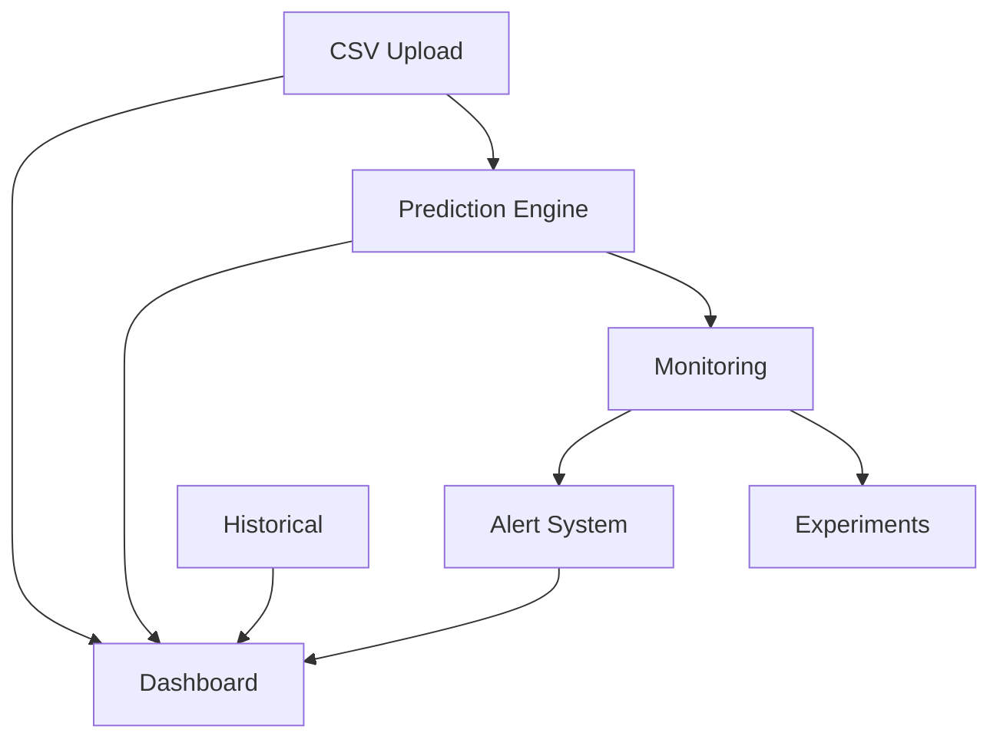

# DineMetra API Documentation

**Version 2.0.0** | Real-time restaurant analytics and prediction platform

---

## Overview

The DineMetra API provides ML-powered predictions for wait times, busyness, and sales, plus historical analytics, alert management, and A/B testing.

**Base URL**: `https://api.dinemetra.com`

---

## Table of Contents

1. [Dashboard](#dashboard)
2. [Predictions](#predictions-current)
3. [Historical Analytics](#historical-analytics)
4. [Alerts](#alert-management)
5. [Data Upload](#data-upload)
6. [Experiments](#experiments--ab-testing)
7. [Monitoring](#monitoring--system-health)
8. [Legacy Endpoints](#legacy-predictions-deprecated)
9. [Data Models](#data-models)
10. [Examples](#example-workflow)

---

## Dashboard

| Method | Endpoint | Description |
|--------|----------|-------------|
| `GET` | `/api/dashboard/dashboard` | **Complete dashboard** - all data in one call |
| `GET` | `/api/dashboard/highlights` | Weekly events (Ticketmaster + Weather) |
| `GET` | `/api/dashboard/sales-chart` | Sales data with predictions |
| `GET` | `/api/dashboard/metrics` | KPIs, top sellers, ML purchasing estimates |
| `GET` | `/api/dashboard/info-sections` | Aggregated Weather, Events, Labor, Historical |
| `GET` | `/api/dashboard/user-profile` | User profile info |
| `POST` | `/api/dashboard/feedback` | Submit prediction accuracy feedback |
| `GET` | `/api/dashboard/health` | Service health check |

### Query Parameters

**GET /api/dashboard/sales-chart**
- `week` - Period: `this-week`, `last-week`, `custom` (default: `this-week`)

**POST /api/dashboard/feedback**
- `prediction_type` (required) - Type of prediction
- `prediction_id` (required) - Prediction ID
- `actual_value` (required) - Real observed value
- `notes` (optional) - Additional notes

---

## Predictions (Current)

**All endpoints use POST with JSON bodies.**

| Endpoint | Description |
|----------|-------------|
| `/api/predictions/wait-time` | Predict wait time |
| `/api/predictions/busyness` | Predict restaurant busyness |
| `/api/predictions/sales` | Predict item sales |
| `/api/predictions/wait-time-enhanced` | **Enhanced** with factor breakdown |
| `/api/predictions/busyness-enhanced` | **Enhanced** with staffing recommendations |
| `/api/predictions/sales-enhanced` | **Enhanced** with confidence margins |
| `/api/predictions/compare-predictions` | Compare multiple predictions |

### Request Schemas

#### WaitTimeRequest
```json
{
  "party_size": 4,
  "current_occupancy": 75.5,
  "timestamp": "2025-12-09T19:00:00Z",
  "test_weather_condition": "sunny"
}
```

#### BusynessRequest
```json
{
  "timestamp": "2025-12-09T19:00:00Z",
  "weather_condition": "clear"
}
```

#### SalesRequest
```json
{
  "item_id": 101,
  "date": "2025-12-09T19:00:00Z",
  "item_name": "Margherita Pizza",
  "category": "Entrees"
}
```

---

## Historical Analytics

| Method | Endpoint | Description |
|--------|----------|-------------|
| `GET` | `/api/historical/compare/wait-times` | Today vs last week vs last year |
| `GET` | `/api/historical/compare/sales` | Today vs last week vs last year |
| `GET` | `/api/historical/compare/busyness` | Today vs last week vs last year |
| `GET` | `/api/historical/compare/all` | **All metrics combined** |
| `GET` | `/api/historical/trends/weekly` | Weekly trends (past N weeks) |
| `GET` | `/api/historical/summary` | Available date ranges & record counts |

### Query Parameters

**All `/compare/*` endpoints:**
- `date` - Reference date (YYYY-MM-DD), defaults to today

**/api/historical/trends/weekly:**
- `weeks` - Number of weeks to analyze: 1-52 (default: 4)

---

## Alert Management

| Method | Endpoint | Description |
|--------|----------|-------------|
| `GET` | `/api/alerts/active` | Get unresolved alerts |
| `GET` | `/api/alerts/history` | Alert history |
| `POST` | `/api/alerts/acknowledge/{alert_id}` | Mark alert as acknowledged |
| `POST` | `/api/alerts/resolve/{alert_id}` | Mark alert as resolved |
| `GET` | `/api/alerts/stats` | Alert statistics |
| `GET` | `/api/alerts/rules` | List all alert rules |

### Query Parameters

**/api/alerts/active:**
- `severity` - Filter: `info`, `warning`, `critical`

**/api/alerts/history:**
- `hours` - Hours back to retrieve: 1-168 (default: 24)
- `limit` - Max alerts: 1-1000 (default: 100)

---

## Data Upload

| Method | Endpoint | Description |
|--------|----------|-------------|
| `POST` | `/api/upload/upload-csv` | Upload sales CSV (multipart/form-data) |
| `GET` | `/api/upload/upload-status` | Check upload status |
| `DELETE` | `/api/upload/clear-uploaded-data` | Reset demo data |

---

## Experiments & A/B Testing

| Method | Endpoint | Description |
|--------|----------|-------------|
| `POST` | `/api/experiments/predictions/log` | Log prediction for tracking |
| `POST` | `/api/experiments/predictions/{log_id}/actual` | Record actual outcome |
| `GET` | `/api/experiments/predictions/logs` | Get prediction logs |
| `GET` | `/api/experiments/models/{model_version}/performance` | Get model metrics |
| `GET` | `/api/experiments/models/compare` | Compare two models |
| `POST` | `/api/experiments/experiments/create` | Create A/B test |
| `GET` | `/api/experiments/experiments/{experiment_id}` | Get experiment results |
| `GET` | `/api/experiments/experiments` | List all experiments |
| `GET` | `/api/experiments/stats` | Overall A/B testing statistics |

---

## Monitoring & System Health

| Method | Endpoint | Description |
|--------|----------|-------------|
| `GET` | `/api/monitoring/model-performance` | Latest training run metrics |
| `GET` | `/api/monitoring/data-health` | ETL logs & data quality |
| `GET` | `/api/monitoring/health` | **Complete system health** check |
| `GET` | `/api/system/info` | System information |
| `GET` | `/health` | Basic health check |
| `GET` | `/` | Root endpoint |

---

## Legacy Predictions (Deprecated)

⚠️ **All legacy endpoints are deprecated and will be removed in v3.0**

| Legacy Endpoint | New Endpoint |
|-----------------|--------------|
| `POST /wait-time` | `POST /api/predictions/wait-time` |
| `POST /busyness` | `POST /api/predictions/busyness` |
| `POST /sales` | `POST /api/predictions/sales` |
| `POST /wait-time-enhanced` | `POST /api/predictions/wait-time-enhanced` |
| `POST /busyness-enhanced` | `POST /api/predictions/busyness-enhanced` |
| `POST /sales-enhanced` | `POST /api/predictions/sales-enhanced` |
| `POST /compare-predictions` | `POST /api/predictions/compare-predictions` |

---

## Data Models

### WaitTimePredictionResponse
```json
{
  "predicted_wait_minutes": 25,
  "confidence": 0.87,
  "factors": {
    "weather_impact": -3,
    "event_impact": 8,
    "occupancy_factor": 15
  }
}
```

### HTTPValidationError
```json
{
  "detail": [
    {
      "loc": ["body", "party_size"],
      "msg": "field required",
      "type": "value_error.missing"
    }
  ]
}
```

---

## Example Workflow

### 1. Get Dashboard
```bash
curl -X GET https://api.dinemetra.com/api/dashboard/dashboard
```

### 2. Predict Wait Time
```bash
curl -X POST https://api.dinemetra.com/api/predictions/wait-time-enhanced \
  -H "Content-Type: application/json" \
  -d '{"party_size": 6, "current_occupancy": 85.0}'
```

### 3. Submit Feedback
```bash
curl -X POST https://api.dinemetra.com/api/dashboard/feedback \
  -H "Content-Type: application/json" \
  -d '{
    "prediction_type": "wait_time",
    "prediction_id": "pred_12345",
    "actual_value": 32,
    "notes": "Higher due to concert"
  }'
```

---

## System Architecture



---

**Last Updated**: December 2025  
**API Version**: 2.0.0 