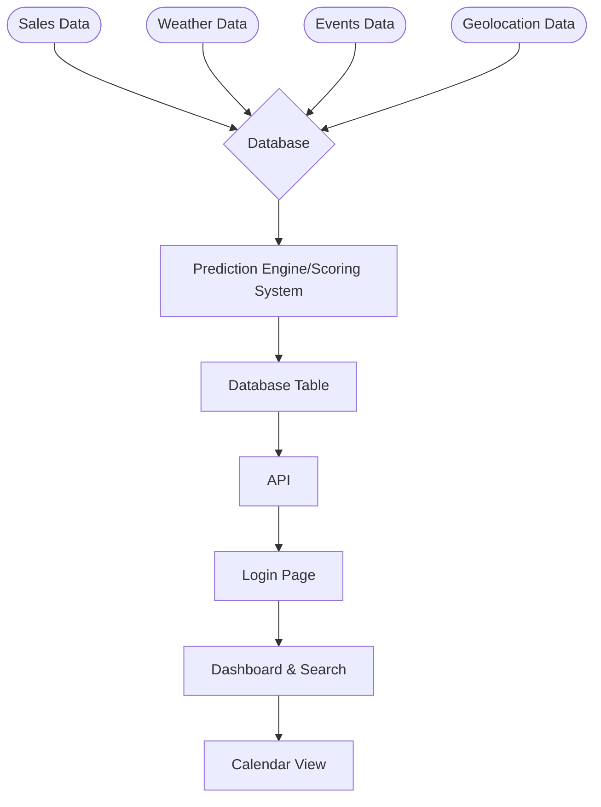

# DineMetra
Forecast. Prepare. Perform.

## Description
Web App for Restaurant Managers that predicts how busy a restaurant will be depending on factors such as past sales data, weather, and other events in the area.

## Setup

### Database Setup
```bash
psql -U your_username -d rushradar_db -f DineMetra/backend/database/schema.sql
```

### Backend Setup
```bash
cd DineMetra/backend
pip install -r requirements.txt
python app/main.py
```

### Frontend Setup
```bash
cd DineMetra/frontend
npm install
npm run dev
```

## Flowchart

